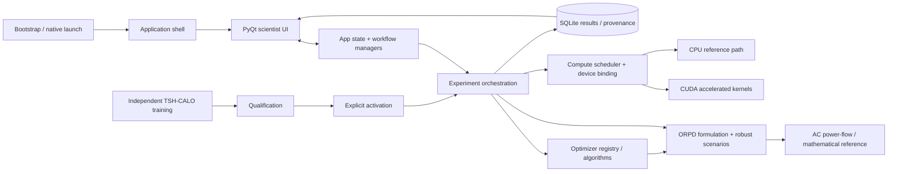

# Architecture

## System shape

## Ownership and boundaries
- **Desktop/application state:** `app/` owns application/workspace/task state and workflow orchestration. `gui/` renders scientist workflows from shared validated state rather than maintaining divergent scientific copies.
- **Scientific domain:** `power_system/`, `orpd/`, and `robustness/` own network models, power-flow evaluation, decision-variable decoding, objectives, constraints, formulation identity, and robust scenarios.
- **Optimization:** `algorithms/` implements common optimizer contracts and algorithm registry. `algorithms/calo/` additionally owns the TSH-CALO policy artifact, training, generalization guard, qualification and activation contracts.
- **Compute:** `compute/` owns resource admission, topology, execution contracts and persistent workers; `accelerated/` supplies device-resident numerical paths. Supported execution is CUDA-preferred or CPU-only; Intel XPU is not executable.
- **Experiments:** `experiments/` owns configuration, budgets, deterministic seeds, execution plans, fairness and runner contracts. Function-evaluation accounting is an explicit scientific invariant.
- **Persistence:** `results/database.py` is the dominant SQLite persistence boundary; `resume/` and `continuation/` preserve restart/extension contracts.
- **Release/validation:** scripts and CI create evidence but must not fabricate scientific, hardware, qualification or release claims.

## Core invariants
1. Deterministic baseline behavior and exact function-evaluation accounting are preserved.
2. Policy training is independent from experiments. Qualification does not activate; activation is explicit and immutable/checksum-bound.
3. Protected cases stay outside training/tuning/checkpoint selection.
4. Exact resume/extension depends on frozen architecture/state/schema/accounting compatibility, not source revision alone.
5. CUDA/CPU resource admission is bounded by the repository's Safe-80 rules; no silent XPU execution.
6. GUI scientific state is shared/validated; ordinary scientist workflows must not expose backend-only engineering controls as scientific choices.
7. Historical release evidence does not automatically qualify the active v12 development tree.

Use the v2 query surface (`get_callers`, `get_callees`, `get_dependencies`, `get_dependents`) and canonical `.ai/index/dependencies/` shards for confidence-labelled machine relationships. Do not infer a runtime call graph from this document alone, and do not rely on deleted v1 root monolithic graph files.
